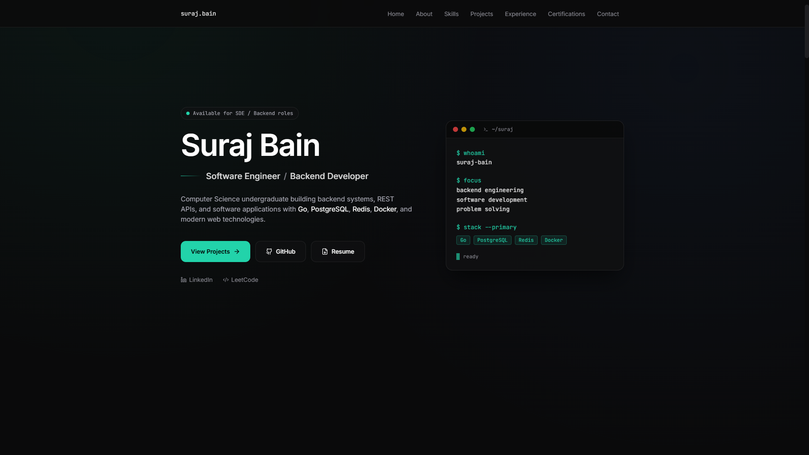
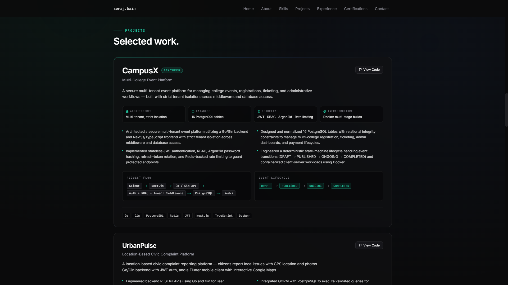
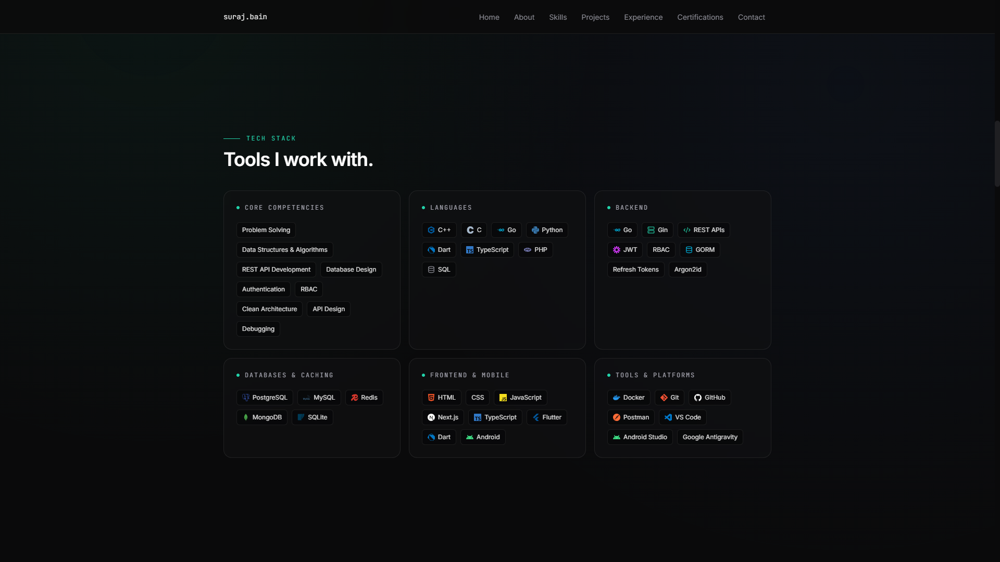

<div align="center">

# Suraj Bain

### Software Engineer · Backend Developer

**Building backend systems, REST APIs, and software products with Go, PostgreSQL, Redis, and Docker.**

[](https://portfolio-surajbain.vercel.app)
[](https://linkedin.com/in/suraj-bain-397478200/)
[](https://github.com/surajbain)
[](https://leetcode.com/u/SurajBain/)

</div>

---

## 📖 About

A **production-quality personal portfolio** built as a **Software Engineer / Backend Developer** showcase. Designed with a focus on performance, accessibility, and premium dark UI.

Computer Science undergraduate at **Bhilai Institute of Technology, Raipur** (graduating 2027), focused on backend engineering, REST APIs, and multi-tenant systems.

---

## 🎨 Preview

<div align="center">

### 🖥️ Home — Hero Section



### 🚀 Featured Projects — CampusX & UrbanPulse



### 🛠️ Tech Stack



</div>

---

## ✨ Features

- ⚡ **Blazing fast** — Optimized with Next.js 14 App Router and static rendering
- 🎨 **Premium dark UI** — Restrained accent color, subtle animations, high contrast
- 📱 **Fully responsive** — Desktop (1440px) to mobile (390px), no horizontal scroll
- ♿ **Accessible** — Semantic HTML, keyboard navigation, focus states, ARIA labels
- 🔍 **SEO optimized** — Meta tags, Open Graph, semantic structure
- 🚀 **Lighthouse-friendly** — Minimal JS, optimized assets
- 🎯 **Data-driven** — All content separated in `data/` folder for easy updates

---

## 🛠️ Tech Stack

<div align="center">

**Framework & Language**


**Styling & Icons**


</div>

---

## 📁 Project Structure

portfolio/
├── app/
│ ├── globals.css # Tailwind + custom styles
│ ├── layout.tsx # Root layout + SEO metadata
│ └── page.tsx # Main page composition
├── components/
│ ├── Navbar.tsx # Sticky nav + mobile menu
│ ├── Hero.tsx # Hero with terminal panel
│ ├── About.tsx # About section
│ ├── Skills.tsx # Tech stack grid
│ ├── Projects.tsx # Featured projects (CampusX, UrbanPulse)
│ ├── Experience.tsx # Timeline
│ ├── Certifications.tsx # HackerRank, Simplilearn
│ ├── ProblemSolving.tsx # LeetCode stats
│ ├── Education.tsx # BIT Raipur
│ ├── Contact.tsx # Final CTA
│ ├── Footer.tsx # Minimal footer
│ ├── Section.tsx # Reusable section wrapper
│ └── Reveal.tsx # Scroll fade-in
├── data/
│ ├── profile.ts # Personal info + links
│ ├── skills.ts # Tech stack groups
│ ├── projects.ts # CampusX, UrbanPulse
│ ├── experience.ts # Trainee roles
│ ├── certifications.ts # Certs with IDs
│ └── education.ts # Academic background
├── public/
│ ├── resume.pdf # Downloadable resume
│ ├── certificates/ # Certificate images + PDFs
│ └── screenshots/ # README previews
└── styles/


---

## 🚀 Getting Started

### Prerequisites

- **Node.js** 18.17 or later
- **npm** or **yarn**

### Installation

```bash
# Clone the repository
git clone https://github.com/surajbain/portfolio.git
cd portfolio

# Install dependencies
npm install

# Run development server
npm run dev